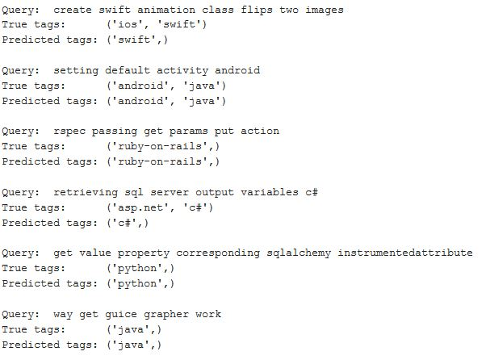
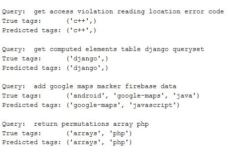
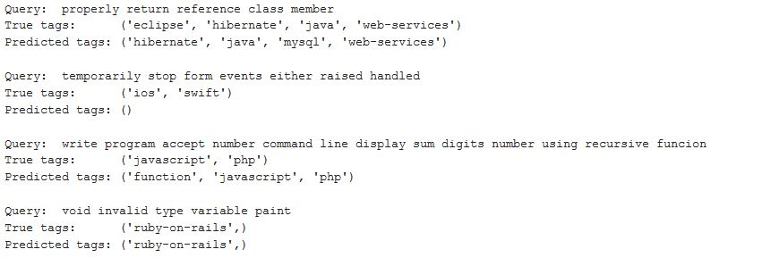
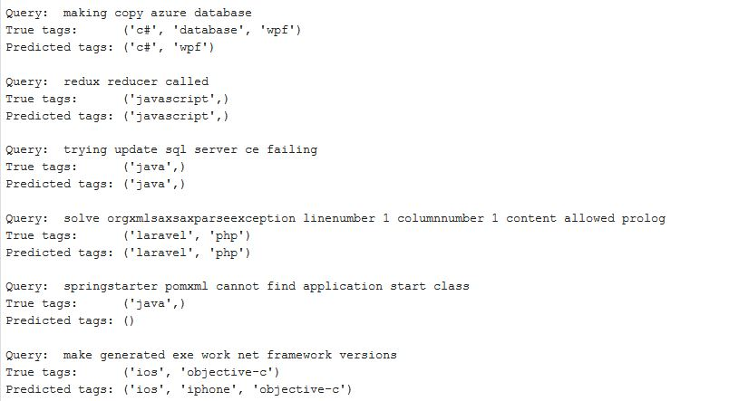

# <u>StackOverflow Question Tagger
StackOverflow lets the users to post their queries and the other users can help them with answers. The site uses tags for managing the questions effectively. Here we will be predicting tags for a given question. Tags like C, C++, Python are widely used.

This model can predict appropriate topic tags for a variety of StackOverflow questions.

## Model Performance: 
### 1. Using Bag of Words

### 2. Using TF-IDF

